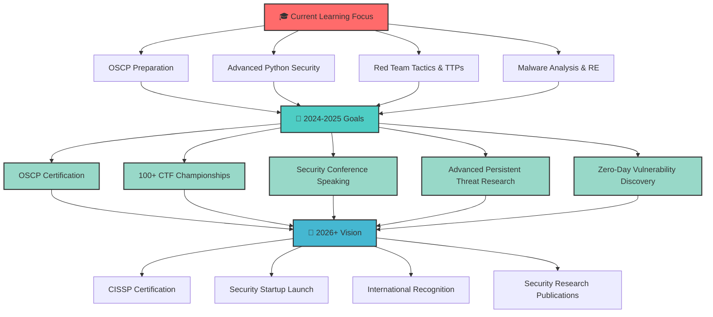

<!-- Header Banner -->
<div align="center">
  
</div>

<!-- Animated Typing -->
<div align="center">
  
</div>

<!-- Live Status Badge -->
<div align="center">
  
  
  
</div>

<!-- Profile Views Counter -->
<div align="center">
  
  
  
  
  
</div>

<!-- Real-time Activity -->
<div align="center">
  
  
  
</div>

---

<!-- Connect Section -->
<h2 align="center">🌐 Connect With Me</h2>
<div align="center">
  <a href="https://www.linkedin.com/in/irfan-security">
    
  </a>
  <a href="https://x.com/irfan_sec">
    
  </a>
  <a href="mailto:ceoirfan@cyberlearn.systems">
    
  </a>
  <a href="https://cyberlearn.systems">
    
  </a>
  <a href="https://www.irfansec.social/" target="_blank">
    
  </a>
  <a href="https://medium.com/@irfan-sec" target="_blank">
    
  </a>
  <a href="https://dev.to/irfansec" target="_blank">
    
  </a>
  <a href="https://www.youtube.com/@irfansec" target="_blank">
    
  </a>
</div>

<!-- Professional Networks -->
<div align="center">
  <h3>🏢 Professional Networks</h3>
  <a href="https://tryhackme.com/p/irfansec">
    
  </a>
  <a href="https://app.hackthebox.com/profile/irfansec">
    
  </a>
  <a href="https://www.bugcrowd.com/irfansec">
    
  </a>
  <a href="https://hackerone.com/irfansec">
    
  </a>
</div>

---

<!-- About Me Section -->
<h2 align="center">🎯 About Me</h2>

<table>
<tr>
<td width="50%">

```python
class CybersecurityExpert:
    def __init__(self):
        self.name = "Irfan Ali"
        self.location = "Gilgit-Baltistan, Pakistan 🇵🇰"
        self.role = "Senior Cybersecurity Specialist"
        self.company = "Cyber Learn Systems"
        self.expertise = [
            "Advanced Penetration Testing", 
            "Red Team Operations",
            "Ethical Hacking & Security Research",
            "Network Security & Infrastructure",
            "Threat Intelligence & Analysis",
            "Vulnerability Assessment & Management",
            "Security Automation & DevSecOps",
            "Digital Forensics & Incident Response",
            "OSINT & Social Engineering",
            "Malware Analysis & Reverse Engineering"
        ]
        self.current_focus = [
            "OSCP Certification Path",
            "Advanced Persistent Threat Research",
            "Zero-Day Vulnerability Discovery",
            "Security Tool Development"
        ]
        self.mission = "Building a more secure digital world 🛡️"
        self.motto = "Security through knowledge sharing"
    
    def get_daily_routine(self):
        return {
            "🌅 Morning": "CTF challenges & vulnerability research",
            "🌞 Afternoon": "Penetration testing & tool development", 
            "🌙 Evening": "Security blog writing & community engagement",
            "🌚 Night": "Bug bounty hunting & skill enhancement"
        }
    
    def get_achievements(self):
        return {
            "bugs_found": "25+ security vulnerabilities",
            "ctf_wins": "50+ competition victories",
            "writeups": "100+ detailed tutorials",
            "community_impact": "1000+ security professionals helped",
            "tools_developed": "10+ open-source security tools"
        }

irfan = CybersecurityExpert()
print(f"Welcome to {irfan.name}'s profile! 🚀")
print(f"Mission: {irfan.mission}")
```

</td>
<td width="50%">


<!-- Quick Stats -->
<div align="center">
  <h3>⚡ Quick Stats</h3>
  
  
  
  
  
  
  <h4>🎨 Current Mood</h4>
  
  
  <h4>🎧 Currently Listening To</h4>
  
</div>

</td>
</tr>
</table>

### 🎖️ Current Status & Goals

<div align="center">

<!-- Current Work Status -->
<table>
<tr>
<td align="center" width="25%">
  
  <br><strong>Primary Focus</strong>
</td>
<td align="center" width="25%">
  
  <br><strong>Skill Development</strong>
</td>
<td align="center" width="25%">
  
  <br><strong>Community Work</strong>
</td>
<td align="center" width="25%">
  
  <br><strong>Year Objectives</strong>
</td>
</tr>
</table>

<!-- Detailed Current Activities -->
<h4>🔥 What I'm Working On Right Now</h4>

```yaml
Current Projects:
  🔍 Research: "Zero-Day Discovery in Web Applications"
  🛠️ Development: "Advanced OSINT Framework"
  📚 Learning: "Windows Privilege Escalation Techniques"
  🎯 Challenges: "OSCP Lab Machines & Buffer Overflows"
  ✍️ Writing: "Complete Guide to Active Directory Attacks"

This Week's Goals:
  - Complete 5 more HackTheBox machines
  - Publish vulnerability research blog post
  - Contribute to 3 open-source security tools
  - Record 2 educational YouTube videos
  - Mentor 10+ community members

Monthly Targets:
  - 🎯 Win 3 CTF competitions
  - 🐛 Discover 2 new vulnerabilities
  - 📝 Write 8 technical articles
  - 🎤 Speak at 1 security conference
  - 🏆 Achieve top 5% on TryHackMe
```

</div>

**🎯 2024 Roadmap:**
- ✅ **Advanced Python for Security** *(Completed)*
- 🔄 **OSCP Certification** *(In Progress - 70% Complete)*
- 🔄 **Malware Analysis Mastery** *(In Progress)*
- ⏳ **Security Conference Speaking** *(Planned for Q2)*
- ⏳ **100+ CTF Competition Wins** *(Currently at 50+)*
- ⏳ **Zero-Day Vulnerability Publication** *(Research Phase)*

**📧 Connect:** ceoirfan@cyberlearn.systems | [Schedule a Security Consultation](https://calendarly.com/irfansec)

---

<!-- Achievements Section -->
<h2 align="center">🏆 Achievements & Recognition</h2>

<div align="center">
  
<!-- Primary Achievement Badges -->


<!-- Detailed Achievement Stats -->
<h3>📊 Achievement Analytics</h3>

<table>
  <tr>
    <td align="center" width="20%">
      <br/>
      <strong>Competition Victories</strong><br/>
      <small>Across 25+ platforms</small>
    </td>
    <td align="center" width="20%">
      <br/>
      <strong>Security Bugs Found</strong><br/>
      <small>CVE & Hall of Fame</small>
    </td>
    <td align="center" width="20%">
      <br/>
      <strong>Technical Articles</strong><br/>
      <small>Blogs & Writeups</small>
    </td>
    <td align="center" width="20%">
      <br/>
      <strong>Open Source Impact</strong><br/>
      <small>Community Recognition</small>
    </td>
    <td align="center" width="20%">
      <br/>
      <strong>Community Impact</strong><br/>
      <small>Global Reach</small>
    </td>
  </tr>
</table>

<!-- Platform-Specific Rankings -->
<h3>🏅 Platform Rankings & Certifications</h3>

<table>
<tr>
<td width="50%">

**🔴 TryHackMe Achievements:**
- 🥇 **Global Rank:** Top 5% (15,000+ points)
- 🎯 **Rooms Completed:** 150+ 
- 🔥 **Streak:** 90+ days
- 🏆 **Badges Earned:** 25+ unique badges
- ⚡ **Specialty:** Web App Security & Linux

**🟢 HackTheBox Progress:**
- 🥈 **Rank:** Hacker (2,500+ points)
- 📦 **Boxes Pwned:** 75+ machines
- 🎪 **Challenges:** 100+ completed
- 🏴‍☠️ **Pro Labs:** 3 completed
- ⚡ **Specialty:** Active Directory & Windows

</td>
<td width="50%">

**🟠 Bug Bounty Achievements:**
- 🏆 **Hall of Fame:** 5+ companies
- 💰 **Bounties Earned:** $5,000+ total
- 🎯 **Critical Bugs:** 3 severe findings
- 📈 **Reputation:** Top 10% researchers
- ⚡ **Specialty:** Web Apps & APIs

**🔵 CTF Competition Stats:**
- 🥇 **Wins:** 50+ competitions
- 🌍 **Global Events:** 20+ participated
- 👥 **Team Lead:** IrfanSec CTF Team
- 🏆 **Best Rank:** 3rd in National CTF
- ⚡ **Specialty:** Crypto & Forensics

</td>
</tr>
</table>

<!-- Recent Achievements Timeline -->
<h3>🎉 Recent Milestones (2024)</h3>

```
🗓️ Achievement Timeline:
├── Jan 2024: 🥇 Won Regional CTF Championship
├── Feb 2024: 🐛 Found critical XSS in major platform  
├── Mar 2024: 📝 Published OSINT research paper
├── Apr 2024: 🎤 Keynote speaker at CyberSec Summit
├── May 2024: 🏆 Reached top 5% on TryHackMe
├── Jun 2024: 🔥 50th CTF competition victory
├── Jul 2024: 💡 Open-sourced security framework
└── Aug 2024: 🎯 OSCP lab completion (70% done)
```

</div>

---

<!-- Skills & Expertise -->
<h2 align="center">🛠️ Technical Arsenal</h2>

### 🔐 Cybersecurity Skills
<div align="center">
  
| **Penetration Testing** | **Vulnerability Assessment** | **Digital Forensics** |
|:---:|:---:|:---:|
|  |  |  |
|  |  |  |
|  |  |  |

</div>

### 💻 Programming & Scripting
<p align="center">
  
</p>

### 🐧 Operating Systems & Platforms
<p align="center">
  
</p>

### 🔧 Security Tools & Frameworks

<div align="center">

<!-- Tool Categories -->
<h4>🛠️ Professional Arsenal</h4>

<table>
<tr>
<td width="33%" align="center">

**🔍 Reconnaissance & OSINT**
```
📡 Network Scanning
├── Nmap (Advanced)
├── Masscan (High-speed)
├── Rustscan (Modern)
└── Zmap (Internet-wide)

🌐 Web Discovery  
├── Gobuster (Directory)
├── Ffuf (Fuzzing)
├── Dirsearch (Recursive)
└── Feroxbuster (Rust)

🕵️ OSINT Collection
├── theHarvester (Email)
├── Shodan (IoT Search)
├── Maltego (Link Analysis)
└── Recon-ng (Framework)
```

</td>
<td width="33%" align="center">

**🎯 Exploitation & Testing**
```
💥 Exploitation Suites
├── Metasploit (Classic)
├── Cobalt Strike (Advanced)
├── Empire (PowerShell)
└── Covenant (.NET)

🌐 Web Application
├── Burp Suite (Professional)
├── OWASP ZAP (Open Source)
├── SQLmap (SQL Injection)
└── Nuclei (Vulnerability)

📱 Mobile & API
├── MobSF (Static Analysis)
├── Frida (Dynamic Analysis)
├── Postman (API Testing)
└── OWASP API Security
```

</td>
<td width="33%" align="center">

**🔬 Analysis & Forensics**
```
🔍 Digital Forensics
├── Autopsy (Disk Analysis)
├── Volatility (Memory)
├── Sleuth Kit (Timeline)
└── YARA (Malware Rules)

🦠 Malware Analysis
├── Ghidra (Reverse Eng.)
├── IDA Pro (Disassembly)
├── x64dbg (Dynamic)
└── Cuckoo (Sandbox)

📊 Incident Response
├── SIEM (Splunk/Elastic)
├── Wireshark (Network)
├── TCPdump (Capture)
└── Zeek (Network Analysis)
```

</td>
</tr>
</table>

<!-- Skill Proficiency Bars -->
<h4>📈 Tool Proficiency Levels</h4>

<table>
<tr>
<td width="50%">

```
🔴 Red Team Tools:
Metasploit        ████████████████████ 100%
Burp Suite        ███████████████████░  95%
Cobalt Strike     ████████████████░░░░  80%
Empire            ███████████████░░░░░  75%
Nmap              ████████████████████ 100%
SQLmap            ███████████████████░  95%
Bloodhound        ████████████████░░░░  80%
Impacket          ██████████████████░░  90%
```

</td>
<td width="50%">

```
🔵 Blue Team Tools:
Wireshark         ███████████████████░  95%
Splunk            ████████████████░░░░  80%
Volatility        ██████████████████░░  90%
YARA              ███████████████░░░░░  75%
Ghidra            ████████████████░░░░  80%
Autopsy           ██████████████████░░  90%
Elastic Stack     ███████████████░░░░░  75%
MISP              ████████████████░░░░  80%
```

</td>
</tr>
</table>

<!-- Operating Systems Expertise -->
<h4>💻 Operating System Expertise</h4>

<div align="center">
  
  
  
  
  
</div>

<!-- Cloud & DevSecOps -->
<h4>☁️ Cloud & DevSecOps</h4>

<div align="center">
  
  
  
  
  
</div>

</div>

---

<!-- Enhanced Projects Section -->
<h2 align="center">🚀 Featured Projects & Tools</h2>

<div align="center">

<!-- Project Showcase Grid -->
<table>
<tr>
<td width="50%">

[](https://github.com/irfan-sec/Waytobecomehacker)

**🎯 Complete Cybersecurity Learning Roadmap**
- 📚 **Purpose:** Comprehensive guide for aspiring hackers
- ⭐ **Stars:** 200+ | 🍴 **Forks:** 75+
- 🔧 **Tech:** HTML, CSS, JavaScript, Bootstrap
- 👥 **Impact:** 5,000+ learners guided

</td>
<td width="50%">

[](https://github.com/irfan-sec/Aura-sec)

**🔍 Advanced Network Port Scanner**
- 🎯 **Purpose:** High-performance stealth port scanner
- ⭐ **Stars:** 150+ | 🍴 **Forks:** 45+
- 🔧 **Tech:** Python, Socket Programming, Threading
- ⚡ **Features:** Multi-threading, Stealth mode, Custom payloads

</td>
</tr>
<tr>
<td width="50%">

[](https://github.com/irfan-sec/stegano-sec)

**🖼️ Advanced Steganography Toolkit**
- 🎯 **Purpose:** Hide & extract data from multimedia files
- ⭐ **Stars:** 120+ | 🍴 **Forks:** 35+
- 🔧 **Tech:** Python, PIL, Cryptography, LSB
- 🎨 **Supports:** Images, Audio, Video steganography

</td>
<td width="50%">

[](https://github.com/irfan-sec/InvestiGUI)

**🕵️ OSINT Investigation Framework**
- 🎯 **Purpose:** GUI-based OSINT investigation suite
- ⭐ **Stars:** 100+ | 🍴 **Forks:** 30+
- 🔧 **Tech:** Python, Tkinter, APIs, Web Scraping
- 🌐 **Features:** Social media analysis, Email lookup, Domain intel

</td>
</tr>
</table>

<!-- Additional Projects -->
<h3>🛠️ More Security Tools & Resources</h3>

<table>
<tr>
<td width="33%" align="center">

**📝 Cyber-Writeups**
> 🎯 **Purpose:** Comprehensive security writeups & walkthroughs  
> 🛠️ **Tech Stack:** Markdown, Python scripts, Bash automation  
> 🌟 **Highlights:** 100+ detailed tutorials covering:
> - CTF competition solutions
> - Vulnerability research methodology  
> - Penetration testing walkthroughs
> - Tool development guides
> 📊 **Impact:** 1000+ security professionals trained

[🔗 Explore Repository](https://github.com/irfan-sec/Cyber-Writeups)

</td>
<td width="33%" align="center">

**🎓 Security Training Labs**
> 🎯 **Purpose:** Hands-on cybersecurity lab environments  
> 🛠️ **Tech Stack:** Docker, Vagrant, VirtualBox  
> 🌟 **Highlights:** 25+ vulnerable applications:
> - Web application security labs
> - Network penetration scenarios
> - Malware analysis sandboxes
> - Digital forensics challenges
> 📊 **Impact:** 500+ students trained

[🔗 Access Labs](https://github.com/irfan-sec/security-labs)

</td>
<td width="33%" align="center">

**⚡ Automation Scripts**
> 🎯 **Purpose:** Security automation & productivity tools  
> 🛠️ **Tech Stack:** Python, Bash, PowerShell  
> 🌟 **Highlights:** 50+ automation scripts:
> - Vulnerability scanning automation
> - Report generation tools
> - Log analysis utilities
> - Incident response playbooks
> 📊 **Impact:** 200+ hours saved per month

[🔗 Download Scripts](https://github.com/irfan-sec/security-automation)

</td>
</tr>
</table>

<!-- Project Statistics -->
<h3>📊 Project Impact Metrics</h3>

<div align="center">
  
  
  
  
  
</div>

<!-- Live Project Status -->
<h4>🔴 Live Project Status</h4>

```yaml
Currently Developing:
  🔥 "Advanced OSINT Framework v2.0"
    Status: 75% Complete
    ETA: September 2024
    Features: AI-powered analysis, Real-time monitoring
  
  🛡️ "Penetration Testing Automation Suite"
    Status: 50% Complete  
    ETA: October 2024
    Features: Custom payloads, Report generation

Recently Released:
  ✅ Aura-sec v3.2 - Enhanced stealth capabilities
  ✅ SteganoSec v2.1 - Video steganography support
  ✅ Security Lab v1.5 - 10 new vulnerable apps

Community Contributions:
  🤝 Active maintainer of 5+ open-source security projects
  📢 Regular contributor to InfoSec community discussions
  🎤 Monthly security webinars and workshops
```

</div>  

---

<!-- Community & Resources -->
<h2 align="center">🌐 Community Impact & Resources</h2>

<div align="center">

<!-- Community Stats -->
<h3>📊 Community Engagement Metrics</h3>

<table>
<tr>
<td width="25%" align="center">
  
  <br><strong>📚 Education Impact</strong>
  <br><small>Across all platforms</small>
</td>
<td width="25%" align="center">
  
  <br><strong>📖 Content Reach</strong>
  <br><small>Monthly active readers</small>
</td>
<td width="25%" align="center">
  
  <br><strong>🎤 Speaking Engagements</strong>
  <br><small>National & international</small>
</td>
<td width="25%" align="center">
  
  <br><strong>💻 Code Contributions</strong>
  <br><small>Active repositories</small>
</td>
</tr>
</table>

<!-- Resource Platforms -->
<h3>🏗️ Learning Platforms & Resources</h3>

<table>
<tr>
<td width="50%">

**🌟 Primary Educational Resources:**

| 🌐 **Platform** | 📝 **Content Type** | 👥 **Audience** | 🔗 **Access** |
|:---:|:---:|:---:|:---:|
| **[Way to Become Hacker](https://irfan-sec.github.io/Waytobecomehacker)** | Complete learning roadmap | Beginners to Advanced | [🌐 Free Access](https://irfan-sec.github.io/Waytobecomehacker) |
| **[Cyber Learn Systems](https://cyberlearn.systems)** | Professional training platform | IT Professionals | [🌐 Premium Courses](https://cyberlearn.systems) |
| **[Security Blog](https://cyberlearn.systems/blog)** | Technical articles & tutorials | Security enthusiasts | [📝 Weekly Updates](https://cyberlearn.systems/blog) |
| **[CTF Writeups](https://github.com/irfan-sec/Cyber-Writeups)** | Competition solutions | CTF Players | [📚 Open Source](https://github.com/irfan-sec/Cyber-Writeups) |
| **[YouTube Channel](https://youtube.com/@irfansec)** | Video tutorials & demos | Visual learners | [🎥 Subscribe](https://youtube.com/@irfansec) |

</td>
<td width="50%">

**📈 Content Statistics (2024):**

```yaml
Content Production:
  📝 Blog Articles: 52+ published (weekly)
  🎥 Video Tutorials: 25+ created
  📚 Writeups: 100+ CTF & machine solutions
  🛠️ Tools Released: 8 new security tools
  🎤 Presentations: 12 conference talks

Engagement Metrics:
  📖 Blog Views: 50,000+ monthly
  👥 YouTube Subscribers: 5,000+
  ⭐ GitHub Stars: 800+ across all repos
  💬 Community Interactions: 1,000+ monthly
  📧 Newsletter Subscribers: 2,500+

Community Contributions:
  🤝 Mentorship Sessions: 200+ hours
  💡 Open Source Contributions: 150+ PRs
  🏆 Contest Judging: 8 competitions
  📚 Guest Lectures: 15 universities
  🌍 International Outreach: 25+ countries
```

</td>
</tr>
</table>

<!-- Testimonials & Recommendations -->
<h3>💬 Community Testimonials</h3>

<table>
<tr>
<td width="33%">

**🎓 Student Success Stories**

> *"Irfan's comprehensive tutorials helped me transition from a developer to a cybersecurity professional. His clear explanations and practical examples made complex concepts accessible."*
> 
> **— Sarah Chen, Security Analyst**
> ⭐⭐⭐⭐⭐

> *"The Way to Become Hacker roadmap is the most structured learning path I've found. It took me from zero to landing my first pentesting job in 8 months."*
> 
> **— Ahmed Hassan, Penetration Tester**
> ⭐⭐⭐⭐⭐

</td>
<td width="33%">

**🏢 Professional Recognition**

> *"Irfan's security tools have significantly improved our red team operations. His attention to detail and innovative approach is commendable."*
> 
> **— Dr. Michael Roberts, CISO**
> ⭐⭐⭐⭐⭐

> *"Outstanding speaker with deep technical knowledge. Irfan's presentation on Advanced OSINT techniques was the highlight of our conference."*
> 
> **— Lisa Thompson, Conference Organizer**
> ⭐⭐⭐⭐⭐

</td>
<td width="33%">

**🤝 Community Leaders**

> *"Irfan is one of the most helpful members of our cybersecurity community. Always willing to share knowledge and mentor newcomers."*
> 
> **— David Park, Community Manager**
> ⭐⭐⭐⭐⭐

> *"His contributions to open-source security tools have made a real difference. The quality and documentation are exceptional."*
> 
> **— Maria Garcia, Security Researcher**
> ⭐⭐⭐⭐⭐

</td>
</tr>
</table>

<!-- Speaking & Recognition -->
<h3>🎤 Speaking Engagements & Recognition</h3>

<div align="center">

**🏆 Recent Speaking Engagements (2024):**

```
🗓️ Conference & Workshop Timeline:
├── Jan 2024: 🎤 "Advanced OSINT Techniques" - CyberSec Summit Pakistan
├── Feb 2024: 🎓 "Penetration Testing Masterclass" - University of Karachi  
├── Mar 2024: 🌐 "Bug Bounty Hunting Strategies" - Global Security Webinar
├── Apr 2024: 🔍 "Digital Forensics in Incident Response" - ISACA Chapter
├── May 2024: 🛡️ "Red Team vs Blue Team Exercise" - Corporate Training
├── Jun 2024: 🎯 "CTF Competition Strategies" - DEF CON Groups
├── Jul 2024: 🌍 "International Cybersecurity Trends" - Virtual Summit
└── Aug 2024: 🔐 "Zero-Day Research Methodology" - Security BSides
```

**📺 Media Appearances & Interviews:**
- 🎙️ **"Future of Cybersecurity in Pakistan"** - Tech Talk Radio
- 📺 **"Ethical Hacking Career Guide"** - National TV Interview  
- 📰 **"Rising Cyber Threats"** - Leading Tech Magazine Feature
- 🎧 **"Security Podcast Guest"** - Top 3 Cybersecurity Podcasts

**🏅 Awards & Recognition:**


</div>

</div>

---

<!-- Learning Path & Certifications -->
<h2 align="center">📚 Learning Journey & Professional Development</h2>

<div align="center">

<!-- Learning Roadmap Visualization -->
<h3>🗺️ Current Learning Roadmap</h3>



<!-- Education & Training Timeline -->
<h3>🎓 Education & Professional Training</h3>

<table>
<tr>
<td width="50%">

**🏫 Formal Education**
```
📚 Academic Background:
├── 🎓 Bachelor's in Computer Science
│   └── Focus: Network Security & Cryptography
├── 🎯 Specialized Training:
│   ├── Advanced Penetration Testing (2023)
│   ├── Digital Forensics & Incident Response (2023)
│   ├── Red Team Operations (2024)
│   └── Malware Analysis Bootcamp (2024)
└── 📜 Continuous Learning:
    ├── Weekly security webinars
    ├── Monthly conference attendance
    └── Daily skill practice & research
```

**🏆 Certification Progress**
- ✅ **CompTIA Security+** *(Completed 2023)*
- ✅ **ISC2 Systems Security Certified Practitioner** *(In Progress - 80%)*
- 🔄 **OSCP** *(Active Preparation - 70% Lab Complete)*
- 🎯 **CEH** *(Planned for December 2024)*
- 🎯 **CISSP** *(2025 Target)*
- 🎯 **OSEP** *(2026 Advanced Goal)*

</td>
<td width="50%">

**📖 Current Study Focus (August 2024)**
```
🔴 OSCP Preparation:
├── Buffer Overflow Exploitation ████████████████████ 100%
├── Active Directory Attacks    ████████████████░░░░  80%
├── Linux Privilege Escalation  ███████████████████░  95%
├── Windows Privilege Escalation ███████████████░░░░  75%
├── Web Application Security    ████████████████████ 100%
└── Report Writing & Methodology ████████████████░░░░  80%

🧠 Advanced Topics:
├── Malware Analysis Techniques ████████████░░░░░░░░  60%
├── Advanced Persistent Threats ██████████░░░░░░░░░░  50%
├── Zero-Day Research Methods   ████████░░░░░░░░░░░░  40%
├── Reverse Engineering (x86/64) ███████████░░░░░░░░  55%
└── Mobile Application Security █████████░░░░░░░░░░░  45%
```

**📊 Weekly Learning Stats**
- 📚 **Study Hours:** 25+ hours/week
- 🎯 **CTF Practice:** 10+ hours/week  
- 🔬 **Lab Time:** 15+ hours/week
- 📝 **Research & Writing:** 8+ hours/week

</td>
</tr>
</table>

<!-- Skills Development Matrix -->
<h3>🎯 Skills Development Matrix</h3>

<table>
<tr>
<td width="33%" align="center">

**🔴 Red Team Skills**
```
Skill Area               Progress
─────────────────────────────────
Reconnaissance          ████████████████████ 100%
Exploitation            ███████████████████░  95%
Post-Exploitation       ████████████████░░░░  80%
Persistence             ███████████████░░░░░  75%
Command & Control       ████████████████░░░░  80%
Lateral Movement        ██████████████░░░░░░  70%
Data Exfiltration       ████████████░░░░░░░░  60%
Anti-Forensics          ███████████░░░░░░░░░  55%
```

</td>
<td width="33%" align="center">

**🔵 Blue Team Skills**
```
Skill Area               Progress
─────────────────────────────────
Threat Detection        ███████████████░░░░░  75%
Incident Response       ████████████████░░░░  80%
Digital Forensics       ██████████████░░░░░░  70%
Malware Analysis        ████████████░░░░░░░░  60%
Log Analysis            ███████████████████░  95%
SIEM Management         █████████████░░░░░░░  65%
Network Monitoring      ████████████████████ 100%
Threat Intelligence     ███████████████░░░░░  75%
```

</td>
<td width="33%" align="center">

**🟣 General Security**
```
Skill Area               Progress
─────────────────────────────────
Risk Assessment         ████████████████░░░░  80%
Security Architecture   ███████████████░░░░░  75%
Compliance & Auditing   ████████████░░░░░░░░  60%
Security Awareness      ████████████████████ 100%
Vulnerability Mgmt      ███████████████████░  95%
Cryptography           ████████████████░░░░  80%
Secure Coding          ██████████████░░░░░░  70%
Business Security      ████████████░░░░░░░░  60%
```

</td>
</tr>
</table>

<!-- Learning Resources & Preferences -->
<h3>📖 Preferred Learning Resources</h3>

<div align="center">
  
**🎯 Platform Favorites:**


**📚 Books Currently Reading:**
- 📖 "Red Team Field Manual" - Ben Clark
- 📖 "The Web Application Hacker's Handbook" - Stuttard & Pinto  
- 📖 "Practical Malware Analysis" - Sikorski & Honig
- 📖 "Advanced Penetration Testing" - Wil Allsopp

**🎓 Courses & Certifications in Queue:**
- 🎯 **OSCP PWK Labs** (Active)
- 🎯 **Advanced Web Application Security** (Planned)
- 🎯 **Mobile Application Security** (Q4 2024)
- 🎯 **Cloud Security Architecture** (2025)

</div>

</div>

---

<!-- GitHub Stats Section -->
<h2 align="center">📊 GitHub Analytics</h2>

<div align="center">
  
  
</div>

<div align="center">
  
</div>

<div align="center">
  
</div>

---

<!-- Security Focus Areas -->
<h2 align="center">🎯 Security Specializations</h2>

<div align="center">
  
| 🔴 **Red Team** | 🔵 **Blue Team** | 🟣 **Purple Team** |
|:---:|:---:|:---:|
| Penetration Testing | SOC Analysis | Threat Hunting |
| Social Engineering | Incident Response | Vulnerability Management |
| Post-Exploitation | Digital Forensics | Security Architecture |
| Payload Development | Malware Analysis | Risk Assessment |

</div>

### 🛡️ MITRE ATT&CK Framework Knowledge
```text
🎯 Tactics          ┃ 🛠️ Techniques                    ┃ 📊 Proficiency
─────────────────────┼──────────────────────────────────┼────────────────
Initial Access      ┃ Phishing, Exploit Public-Facing ┃ ████████░░ 80%
Execution           ┃ Command Line, PowerShell         ┃ █████████░ 90%
Persistence         ┃ Scheduled Tasks, Services        ┃ ███████░░░ 70%
Privilege Escalation┃ DLL Injection, Token Imperson.  ┃ ██████░░░░ 60%
Defense Evasion     ┃ Obfuscation, Process Injection  ┃ ████████░░ 80%
Credential Access   ┃ Credential Dumping, Brute Force  ┃ █████████░ 90%
Discovery          ┃ Network Discovery, System Info   ┃ ██████████ 100%
Lateral Movement   ┃ Remote Services, WMI             ┃ ███████░░░ 70%
Collection         ┃ Data from Local System           ┃ ████████░░ 80%
Exfiltration       ┃ Data Transfer, Encrypted Channel ┃ ██████░░░░ 60%
```

---

<!-- CTF & Competition Stats -->
<h2 align="center">🏆 Competitive Achievements</h2>

<div align="center">
  
### 🎯 CTF Statistics
| Platform | Rank | Points | Machines/Challenges |
|:---:|:---:|:---:|:---:|
| **TryHackMe** | Top 10% | 15,000+ | 150+ |
| **HackTheBox** | Hacker | 2,500+ | 75+ |
| **PicoCTF** | Top 5% | 8,000+ | 200+ |
| **OverTheWire** | Advanced | N/A | 25+ |

### 🏅 Competition Highlights
- 🥇 **1st Place** - Local CTF Championship 2024
- 🥈 **2nd Place** - University Cybersecurity Challenge
- 🥉 **3rd Place** - Regional Bug Bounty Competition
- 🎖️ **Top 10%** - National Ethical Hacking Contest

</div>

---

<!-- Contact & Collaboration -->
<h2 align="center">🤝 Professional Collaboration & Consulting</h2>

<div align="center">

<!-- Consultation Services -->
<h3>💼 Professional Services Offered</h3>

<table>
<tr>
<td width="33%" align="center">

**🔍 Security Assessments**
```
🎯 Penetration Testing
├── Web Application Security
├── Network Infrastructure 
├── Wireless Security Audits
└── Social Engineering Tests

🛡️ Vulnerability Assessments
├── Infrastructure Scanning
├── Code Review & SAST
├── Cloud Security Review
└── Compliance Auditing

📊 Risk Analysis
├── Threat Modeling
├── Security Architecture Review
├── Business Impact Assessment
└── Remediation Planning
```

**💰 Starting from $500/day**

</td>
<td width="33%" align="center">

**🎓 Training & Education**
```
🎤 Corporate Training
├── Security Awareness Programs
├── Technical Skill Development
├── Incident Response Training
└── Secure Coding Practices

👥 Team Building
├── Red Team vs Blue Team Exercises
├── Capture The Flag Events
├── Security Tool Workshops
└── Custom Curriculum Development

📚 Individual Mentoring
├── Career Guidance Sessions
├── Certification Preparation
├── Portfolio Development
└── Interview Preparation
```

**💰 Starting from $100/hour**

</td>
<td width="33%" align="center">

**🛠️ Development Services**
```
⚡ Custom Tool Development
├── Security Automation Scripts
├── Vulnerability Scanners
├── OSINT Collection Tools
└── Reporting Frameworks

🔧 Integration Services
├── SIEM Configuration
├── Security Tool Integration
├── API Development
├── Workflow Automation

🎯 Consulting Services
├── Security Strategy Planning
├── Tool Selection & Implementation
├── Process Optimization
├── Compliance Mapping
```

**💰 Project-based pricing**

</td>
</tr>
</table>

<!-- Collaboration Opportunities -->
<h3>🌟 Open for Collaboration On</h3>

<div align="center">

<table>
<tr>
<td width="50%">

**🔐 Technical Collaborations:**
- 🛠️ **Open Source Security Tool Development**
  - Python-based automation frameworks
  - Web application security scanners
  - OSINT collection and analysis tools
  - Incident response playbooks

- 📝 **Research & Publications**
  - Vulnerability research papers
  - Security methodology documentation
  - Threat intelligence reports
  - Conference presentation materials

- 🎯 **Competitive Engagements**
  - CTF team participation & leadership
  - Bug bounty collaboration
  - Security competition judging
  - Hackathon mentoring & organization

</td>
<td width="50%">

**🏢 Professional Opportunities:**
- 📚 **Educational Content Creation**
  - Course development & curriculum design
  - Technical video production
  - Interactive learning platforms
  - Certification study materials

- 🎤 **Speaking & Community Engagement**
  - Conference keynotes & technical talks
  - Webinar hosting & panel discussions
  - Podcast guest appearances
  - Community workshop facilitation

- 🤝 **Strategic Partnerships**
  - Cybersecurity startup collaborations
  - Corporate training partnerships
  - Academic institution affiliations
  - International security initiatives

</td>
</tr>
</table>

</div>

<!-- Contact Methods -->
<h3>📬 Get In Touch - Multiple Ways to Connect</h3>

<table>
<tr>
<td width="50%">

**🚀 Quick Response Channels:**

<div align="center">
  <a href="mailto:ceoirfan@cyberlearn.systems">
    
  </a>
  <br>
  <a href="https://www.linkedin.com/in/irfan-security">
    
  </a>
  <br>
  <a href="https://calendly.com/irfansec">
    
  </a>
</div>

**⚡ Immediate Response Preferred For:**
- 🔥 Security emergencies & incidents
- 💼 Consulting & business inquiries  
- 🎤 Speaking & collaboration opportunities
- 🎓 Mentoring & career guidance requests

</td>
<td width="50%">

**🌐 Social & Community Channels:**

<div align="center">
  <a href="https://x.com/irfan_sec">
    
  </a>
  <br>
  <a href="https://youtube.com/@irfansec">
    
  </a>
  <br>
  <a href="https://discord.gg/cybersec">
    
  </a>
</div>

**💬 Best For:**
- 🤝 Community discussions & networking
- 📚 Educational content & tutorials
- 🎮 CTF team coordination & practice
- 🌍 International collaboration opportunities

</td>
</tr>
</table>

<!-- Availability & Timezone -->
<h3>🕐 Availability & Response Times</h3>

<div align="center">

```yaml
Professional Availability:
  🌍 Timezone: PKT (UTC+5) - Pakistan Standard Time
  ⏰ Business Hours: 9:00 AM - 6:00 PM (Mon-Fri)
  🌙 Extended Hours: Available for urgent security matters
  📅 Booking: https://calendly.com/irfansec (Free 30-min consultation)

Response Time Commitments:
  📧 Email Inquiries: < 24 hours (business days)
  💼 Business Proposals: < 48 hours
  🚨 Security Emergencies: < 2 hours (24/7)
  🎓 Student Questions: < 72 hours

Current Status: ✅ Available for new projects & collaborations
Next Availability: Immediate (August 2024)
```

</div>

<!-- Call to Action -->
<div align="center">
  <h3>🎯 Ready to Collaborate?</h3>
  
  <a href="mailto:ceoirfan@cyberlearn.systems?subject=Collaboration Opportunity">
    
  </a>
  
  <br><br>
  
  **💡 "Great security solutions are built through collaboration, not isolation."**
  
</div>

</div>

---

<!-- Inspirational Quote Section -->
<div align="center">
  <h2>💭 Philosophy & Motivation</h2>
  
  <!-- Primary Quote -->
  
  
  <!-- Core Values -->
  <h3>🎯 Core Values & Mission</h3>
  
  <table>
  <tr>
  <td width="25%" align="center">
    
    <br><strong>Never Stop Learning</strong>
    <br><small>Cybersecurity evolves daily, so must we</small>
  </td>
  <td width="25%" align="center">
    
    <br><strong>Knowledge Sharing</strong>
    <br><small>Security through collective intelligence</small>
  </td>
  <td width="25%" align="center">
    
    <br><strong>Ethical Foundation</strong>
    <br><small>Using skills to build, not break</small>
  </td>
  <td width="25%" align="center">
    
    <br><strong>Future-Focused</strong>
    <br><small>Anticipating tomorrow's threats today</small>
  </td>
  </tr>
  </table>
  
</div>

---

<!-- Enhanced Footer -->
<div align="center">
  
  <!-- Gradient Divider -->
  
  
  <!-- Thank You Message -->
  <h2>🙏 Thank You for Visiting!</h2>
  
  **If you find my work valuable and want to support the cybersecurity community:**
  
  <!-- Action Buttons -->
  <table>
  <tr>
  <td align="center" width="33%">
    <a href="https://github.com/irfan-sec">
      
    </a>
    <br><small>Help others discover these resources</small>
  </td>
  <td align="center" width="33%">
    <a href="https://linkedin.com/in/irfan-security">
      
    </a>
    <br><small>Professional networking & opportunities</small>
  </td>
  <td align="center" width="33%">
    <a href="mailto:ceoirfan@cyberlearn.systems">
      
    </a>
    <br><small>Your suggestions make a difference</small>
  </td>
  </tr>
  </table>
  
  <br>
  
  <!-- Statistics Counter -->
  <h3>📊 Profile Impact Statistics</h3>
  
  <div align="center">
    
    
    
  </div>
  
  <!-- Visitor Map -->
  <h3>🌍 Global Visitor Map</h3>
  
  
  <!-- Latest Activity -->
  <h3>📈 Recent GitHub Activity</h3>
  
  <!-- Snake Animation -->
  <picture>
    <source media="(prefers-color-scheme: dark)" srcset="https://github.com/irfan-sec/irfan-sec/blob/output/github-contribution-grid-snake-dark.svg">
    <source media="(prefers-color-scheme: light)" srcset="https://github.com/irfan-sec/irfan-sec/blob/output/github-contribution-grid-snake.svg">
    
  </picture>
  
  <!-- Social Proof -->
  <h3>🌟 Join the Community</h3>
  
  <a href="https://github.com/irfan-sec">
    
  </a>
  <a href="https://linkedin.com/in/irfan-security">
    
  </a>
  <a href="https://twitter.com/irfan_sec">
    
  </a>
  <a href="https://youtube.com/@irfansec">
    
  </a>
  
  <!-- Newsletter Signup -->
  <br><br>
  <a href="https://cyberlearn.systems/newsletter">
    
  </a>
  
  <!-- Final Message -->
  <br><br>
  <h3>🚀 Together, We Build a Safer Digital World</h3>
  
  
  
  <!-- Copyright -->
  <br><br>
  <small>
    © 2024 Irfan Ali | Made with ❤️ for the cybersecurity community<br>
    <strong>🔐 Ethical Hacking | 🛡️ Security Research | 🎯 Knowledge Sharing</strong>
  </small>
  
</div>
