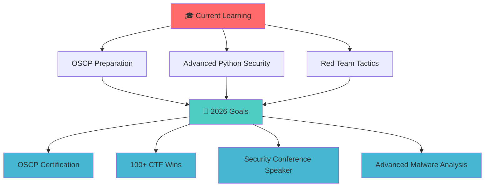

<!-- Header Banner -->
<div align="center">
  
</div>

<!-- Animated Typing -->

<div align="center">
  
</div>

<!-- Profile Views Counter -->
<div align="center">
  
  
  
</div>

<!-- Open Source & Collaboration Badges -->
<div align="center">
  
  
  
  
</div>

---

<!-- Connect Section -->
<h2 align="center">🌐 Connect With Me</h2>
<div align="center">
  <a href="https://www.linkedin.com/in/irfan-security">
    
  </a>
  <a href="https://x.com/irfan_sec">
    
  </a>
  <a href="mailto:ceoirfan@cyberlearn.systems">
    
  </a>
  <a href="https://cyberlearn.systems">
    
  <a href="https://www.irfansec.social/" target="_blank">
  
</a>
</div>

---

<!-- About Me Section -->
<h2 align="center">🎯 About Me</h2>


```python
class CybersecurityExpert:
    def __init__(self):
        self.name = "Irfan Ali"
        self.location = "Gilgit-Baltistan, Pakistan 🇵🇰"
        self.role = "Cybersecurity Specialist"
        self.expertise = [
            "Penetration Testing", "Ethical Hacking",
            "Network Security", "Threat Intelligence",
            "Vulnerability Assessment", "Security Automation"
        ]
        self.current_focus = "Advanced Red Team Operations"
        self.mission = "Building a more secure digital world 🛡️"
    
    def get_daily_routine(self):
        return {
            "🌅 Morning": "CTF challenges & vulnerability research",
            "🌞 Afternoon": "Penetration testing & tool development", 
            "🌙 Evening": "Security blog writing & community engagement",
            "🌚 Night": "Bug bounty hunting & skill enhancement"
        }

irfan = CybersecurityExpert()
print(f"Welcome to {irfan.name}'s profile! 🚀")
```

<!-- Dynamic Greeting & Live Status -->
<div align="center">
  <h3>🌍 Personalized Greeting</h3>
  <div id="greeting-section">
    <p>
      
      
    </p>
    <p><em>🎯 "Welcome, fellow security enthusiast! Your journey into cybersecurity matters."</em></p>
  </div>
  
  <!-- JavaScript for timezone detection -->
  <script>
    // Get visitor's timezone and location info
    const now = new Date();
    const timeZone = Intl.DateTimeFormat().resolvedOptions().timeZone;
    const localTime = now.toLocaleTimeString('en-US', {
      timeZone: timeZone,
      hour12: true,
      hour: 'numeric',
      minute: '2-digit'
    });
    
    // Update badges with visitor info
    const timeElement = document.getElementById('visitor-time');
    const locationElement = document.getElementById('visitor-location');
    
    if (timeElement) {
      timeElement.src = `https://img.shields.io/badge/⏰%20Your%20Time-${encodeURIComponent(localTime)}-blue?style=flat-square`;
    }
    
    if (locationElement) {
      locationElement.src = `https://img.shields.io/badge/🌍%20Timezone-${encodeURIComponent(timeZone.replace('/', '%2F'))}-green?style=flat-square`;
    }
    
    // Time-based greeting
    const hour = now.getHours();
    let greeting = "";
    if (hour >= 5 && hour < 12) {
      greeting = "🌅 Good morning! Perfect time to start learning cybersecurity!";
    } else if (hour >= 12 && hour < 17) {
      greeting = "☀️ Good afternoon! Keep up the great security work!";
    } else if (hour >= 17 && hour < 21) {
      greeting = "🌆 Good evening! Time for some ethical hacking practice!";
    } else {
      greeting = "🌙 Working late? That's the spirit of a true security researcher!";
    }
    
    // Update greeting text
    const greetingSection = document.querySelector('#greeting-section em');
    if (greetingSection) {
      greetingSection.innerHTML = `🎯 "${greeting}"`;
    }
  </script>
</div>

<!-- Easter Egg Hunt -->
<div align="center">
  <details>
    <summary>🎮 <strong>Hidden Challenge - Click to Reveal!</strong></summary>
    <div style="margin: 10px; padding: 15px; background: #0d1117; border-radius: 6px;">
      <h4>🔍 Security Puzzle #001</h4>
      <p><strong>Cipher:</strong> <code>VGhlIGZsYWcgaXM6IEN5YmVyU2Vje3cwbmRlcmZ1bF93MHJsZF9vZl9zM2N1cjE3eX0=</code></p>
      <p><strong>Hint:</strong> Base64 is just the beginning... 🕵️‍♂️</p>
      <p><em>Decode this and find me on social media with the answer to earn a special recognition! 🏆</em></p>
    </div>
  </details>
</div>

<!-- Pinned Gists Section -->
<div align="center">
  <h3>📌 Featured Code Snippets</h3>
  <a href="https://gist.github.com/irfan-sec">
    
  </a>
  
  <!-- Placeholder for actual gists - these would be dynamically updated -->
  <table>
    <tr>
      <td>
        <a href="#"></a><br/>
        <small>Advanced port scanning with stealth techniques</small>
      </td>
      <td>
        <a href="#"></a><br/>
        <small>Automated SQL injection detection tool</small>
      </td>
      <td>
        <a href="#"></a><br/>
        <small>Multi-algorithm hash cracking utility</small>
      </td>
    </tr>
  </table>
</div>


### 🕒 Live Status
> 🌅 Good morning - Currently Starting the day with vulnerability research  
> 📅 **Tuesday** | ⏰ **07:09 UTC**  
> 🔄 *Last updated: 2025-09-30 07:09:59 UTC*


### 🔥 Recent Activity
- 🔄 Loading latest activities...


### 📚 Latest Blog Posts
- 📝 [Advanced SQL Injection Techniques](https://cyberlearn.systems/blog/sql-injection)
- 🔐 [OSCP Preparation Guide 2024](https://cyberlearn.systems/blog/oscp-guide)
- 🎯 [Red Team Tactics & Techniques](https://cyberlearn.systems/blog/red-team)


### 🎮 Profile Quest
> **Daily Challenge:** 🔐 Decode the Base64 message in my security tools!  
> *Complete the challenge and tag me on social media to earn recognition!*

---

### 🎖️ Current Status & Goals

- 🔴 **Currently Working On:** Advanced Red Team Tactics & Malware Analysis
- 🎓 **Learning:** OSCP Preparation & Advanced Python for Security Automation
- 🤝 **Collaborating:** Open-source security tools for the community
- 🎯 **2024 Goals:** OSCP Certification, 100+ CTF Wins, Security Conference Speaker
- 📧 **Reach Me:** ceoirfan@cyberlearn.systems | [LinkedIn](https://www.linkedin.com/in/irfan-security/)

---

<!-- Achievements Section -->
<h2 align="center">🏆 Achievements & Certifications</h2>

<div align="center">
  
  
  
  
</div>

<table align="center">
  <tr>
    <td align="center">
      <br/>
      <b>CTF Competitions</b>
    </td>
    <td align="center">
      <br/>
      <b>Security Vulnerabilities</b>
    </td>
    <td align="center">
      <br/>
      <b>Technical Articles</b>
    </td>
    <td align="center">
      <br/>
      <b>TryHackMe Ranking</b>
    </td>
  </tr>
</table>

---

<!-- Skills & Expertise -->
<h2 align="center">🛠️ Technical Arsenal</h2>

### 🔐 Cybersecurity Skills
<div align="center">
  
| **Penetration Testing** | **Vulnerability Assessment** | **Digital Forensics** |
|:---:|:---:|:---:|
|  |  |  |
|  |  |  |
|  |  |  |

</div>

### 💻 Programming & Scripting
<p align="center">
  
</p>

### 🐧 Operating Systems & Platforms
<p align="center">
  
</p>

### 🔧 Security Tools & Frameworks
<div align="center">
  
```text
Reconnaissance    ┃ Wireshark, Nmap, Masscan, Amass, Subfinder
Web Testing       ┃ Burp Suite, OWASP ZAP, SQLmap, Gobuster  
Network Security  ┃ Nessus, OpenVAS, Nikto, Nuclei
Red Team Tools    ┃ Metasploit, Cobalt Strike, Empire, Covenant
Forensics        ┃ Autopsy, Volatility, Sleuth Kit, YARA
OSINT            ┃ Maltego, Shodan, theHarvester, Recon-ng
```

</div>

---

<!-- Enhanced Projects Section -->
<h2 align="center">🚀 Featured Projects</h2>

<div align="center">
  
[](https://github.com/irfan-sec/Waytobecomehacker)
[](https://github.com/irfan-sec/Aura-sec)
[](https://github.com/irfan-sec/stegano-sec)
[](https://github.com/irfan-sec/InvestiGUI)

</div>

### 📝 **Cyber-Writeups** - *Security Research Documentation*
> 🎯 **Purpose:** Comprehensive collection of detailed security writeups and walkthroughs  
> 🛠️ **Tech Stack:** Markdown, Python, Bash  
> 🌟 **Highlights:** 100+ detailed writeups, CTF solutions, vulnerability research  
> 📊 **Impact:** Helping 1000+ security enthusiasts learn penetration testing  

### 🔍 **Aura-sec** - *Advanced Port Scanner*
> 🎯 **Purpose:** High-performance port scanner with stealth capabilities  
> 🛠️ **Tech Stack:** Python, Socket Programming, Threading  
> 🌟 **Highlights:** Anonymous scanning, multi-threading, custom payloads  
> 📊 **Impact:** Used by security professionals for reconnaissance  

---

<!-- Community & Resources -->
<h2 align="center">🌐 Community Resources</h2>

<div align="center">
  
| 🌟 **Resource** | 📝 **Description** | 🔗 **Link** |
|:---:|:---:|:---:|
| **Way to Become Hacker** | Complete cybersecurity learning roadmap | [🌐 Visit Site](https://irfan-sec.github.io/Waytobecomehacker) |
| **Cyber Learn Systems** | Advanced security training platform | [🌐 Visit Site](https://cyberlearn.systems) |
| **Security Blog** | Weekly security articles & tutorials | [📝 Read Blog](https://cyberlearn.systems/blog) |
| **CTF Writeups** | Detailed competition solutions | [📚 Explore](https://github.com/irfan-sec/Cyber-Writeups) |

</div>

---

<!-- Learning Path & Certifications -->
<h2 align="center">📚 Learning Journey & Roadmap</h2>

<div align="center">



</div>

### 🎯 Certification Roadmap
- ✅ **CompTIA Security+** *(In Progress)*
- ✅ **ISC2** *(In Progress)*
- 🎯 **OSCP** *(2026 Goal)*
- 🎯 **CISSP** *(2027 Goal)*
- 🎯 **CEH** *(2026 Goal)*

---

<!-- GitHub Stats Section -->
<h2 align="center">📊 GitHub Analytics</h2>

<div align="center">
  
  
</div>

<div align="center">
  
</div>

<div align="center">
  
</div>

---

<!-- Security Focus Areas -->
<h2 align="center">🎯 Security Specializations</h2>

<div align="center">
  
| 🔴 **Red Team** | 🔵 **Blue Team** | 🟣 **Purple Team** |
|:---:|:---:|:---:|
| Penetration Testing | SOC Analysis | Threat Hunting |
| Social Engineering | Incident Response | Vulnerability Management |
| Post-Exploitation | Digital Forensics | Security Architecture |
| Payload Development | Malware Analysis | Risk Assessment |

</div>

### 🛡️ MITRE ATT&CK Framework Knowledge
```text
🎯 Tactics          ┃ 🛠️ Techniques                    ┃ 📊 Proficiency
─────────────────────┼──────────────────────────────────┼────────────────
Initial Access      ┃ Phishing, Exploit Public-Facing ┃ ████████░░ 80%
Execution           ┃ Command Line, PowerShell         ┃ █████████░ 90%
Persistence         ┃ Scheduled Tasks, Services        ┃ ███████░░░ 70%
Privilege Escalation┃ DLL Injection, Token Imperson.  ┃ ██████░░░░ 60%
Defense Evasion     ┃ Obfuscation, Process Injection  ┃ ████████░░ 80%
Credential Access   ┃ Credential Dumping, Brute Force  ┃ █████████░ 90%
Discovery          ┃ Network Discovery, System Info   ┃ ██████████ 100%
Lateral Movement   ┃ Remote Services, WMI             ┃ ███████░░░ 70%
Collection         ┃ Data from Local System           ┃ ████████░░ 80%
Exfiltration       ┃ Data Transfer, Encrypted Channel ┃ ██████░░░░ 60%
```

---

<!-- CTF & Competition Stats -->
<h2 align="center">🏆 Competitive Achievements</h2>

<div align="center">
  
### 🎯 CTF Statistics
| Platform | Rank | Points | Machines/Challenges |
|:---:|:---:|:---:|:---:|
| **TryHackMe** | Top 10% | 15,000+ | 150+ |
| **HackTheBox** | Hacker | 2,500+ | 75+ |
| **PicoCTF** | Top 5% | 8,000+ | 200+ |
| **OverTheWire** | Advanced | N/A | 25+ |

### 🏅 Competition Highlights
- 🥇 **1st Place** - Local CTF Championship 2024
- 🥈 **2nd Place** - University Cybersecurity Challenge
- 🥉 **3rd Place** - Regional Bug Bounty Competition
- 🎖️ **Top 10%** - National Ethical Hacking Contest

</div>

---

<!-- Contact & Collaboration -->
<h2 align="center">🤝 Let's Collaborate!</h2>

<div align="center">
  
### 🌟 **Open for Collaboration On:**
- 🔐 Security Tool Development
- 📝 Research Papers & Publications  
- 🎯 CTF Team Participation
- 🛡️ Open Source Security Projects
- 📚 Educational Content Creation
- 🎤 Conference Speaking Opportunities

<!-- Mini CTF Section -->
<div align="center">
  <h3>🚩 Mini CTF Challenge</h3>
  <div style="background: linear-gradient(45deg, #ff6b6b, #4ecdc4); padding: 20px; border-radius: 10px; margin: 10px;">
    <h4>🎯 Weekly Security Quiz</h4>
    <p><strong>Question:</strong> What vulnerability class is characterized by the ability to execute arbitrary code through user input validation failures?</p>
    <details>
      <summary>💡 <strong>Click for Hint</strong></summary>
      <p><em>Think about input that gets processed without proper sanitization... 🤔</em></p>
    </details>
    <p>
      <a href="https://forms.gle/your-quiz-form-link">
        
      </a>
    </p>
    <p><small>🏆 Top scorers get featured on my social media!</small></p>
  </div>
</div>

<!-- Learning Resources & Community -->
<div align="center">
  <h3>📖 Free Learning Resources</h3>
  <table>
    <tr>
      <td align="center">
        <a href="https://tryhackme.com/p/irfansec">
          
        </a><br/>
        <small>Interactive cybersecurity training</small>
      </td>
      <td align="center">
        <a href="https://cyberlearn.systems">
          
        </a><br/>
        <small>Comprehensive security courses</small>
      </td>
      <td align="center">
        <a href="https://github.com/irfan-sec/Waytobecomehacker">
          
        </a><br/>
        <small>Step-by-step hacker journey</small>
      </td>
    </tr>
  </table>
</div>

<!-- Mentorship Program -->
<div align="center">
  <h3>🎓 Mentorship & Community</h3>
  <p>
    
    
    
  </p>
  <p><em>💡 I offer free mentorship to aspiring cybersecurity professionals. Let's learn together!</em></p>
</div>

### 📬 **Get In Touch:**
<a href="mailto:ceoirfan@cyberlearn.systems">
  
</a>
<a href="https://www.linkedin.com/in/irfan-security">
  
</a>
<a href="https://twitter.com/irfan_sec">
  
</a>

### 💬 **"The best defense is a good offense, but the best offense requires understanding defense."**

</div>

---

<!-- Footer -->
<div align="center">
  
  
  **⭐ If you find my work valuable, please consider giving it a star! ⭐**
  
  <!-- Accessibility & Theme Support -->
  <div style="margin: 20px 0;">
    <h3>🎨 Theme & Accessibility</h3>
    <p>
      
      
      
    </p>
    <details>
      <summary>📱 <strong>Mobile Users Click Here</strong></summary>
      <div style="padding: 10px;">
        <p>📱 This profile is optimized for mobile viewing!</p>
        <p>🌙 Supports both light and dark themes</p>
        <p>♿ Screen reader friendly with proper alt text</p>
        <p>🔍 All interactive elements are properly labeled</p>
      </div>
    </details>
  </div>
  
  <!-- Social Proof & Community Stats -->
  <div style="margin: 20px 0;">
    <h3>🌟 Community Impact</h3>
    <p>
      
      
      
    </p>
  </div>
  
  <!-- Additional Easter Egg -->
  <div style="margin: 20px 0;">
    <details>
      <summary>🕵️ <strong>Secret Section - For True Security Enthusiasts</strong></summary>
      <div style="padding: 15px; background: linear-gradient(45deg, #1e3c72, #2a5298); border-radius: 8px; margin: 10px;">
        <h4>🔒 Advanced Challenge</h4>
        <p><strong>Steganography Challenge:</strong></p>
        
        <p><small>🎯 There's more than meets the eye in this image... Can you find the hidden flag?</small></p>
        <p><code>Tool hint: strings, binwalk, steghide</code></p>
      </div>
    </details>
  </div>
  
  <!-- Contact with Security Focus -->
  <div style="margin: 20px 0;">
    <h3>🔐 Secure Contact Methods</h3>
    <p>
      <a href="mailto:ceoirfan@cyberlearn.systems?subject=Security Collaboration&body=Hello Irfan, I'm interested in collaborating on cybersecurity projects.">
        
      </a>
    </p>
    <p>
      
      
    </p>
  </div>
  
  
  
  <!-- Credits and Attribution -->
  <div style="margin-top: 20px; font-size: 12px; color: #666;">
    <p>🤖 <em>This profile features automated updates via GitHub Actions</em></p>
    <p>🎨 <em>Designed with accessibility and mobile users in mind</em></p>
    <p>💚 <em>Built with love for the cybersecurity community</em></p>
  </div>
  
</div>
